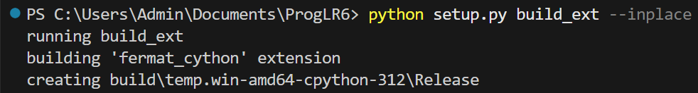
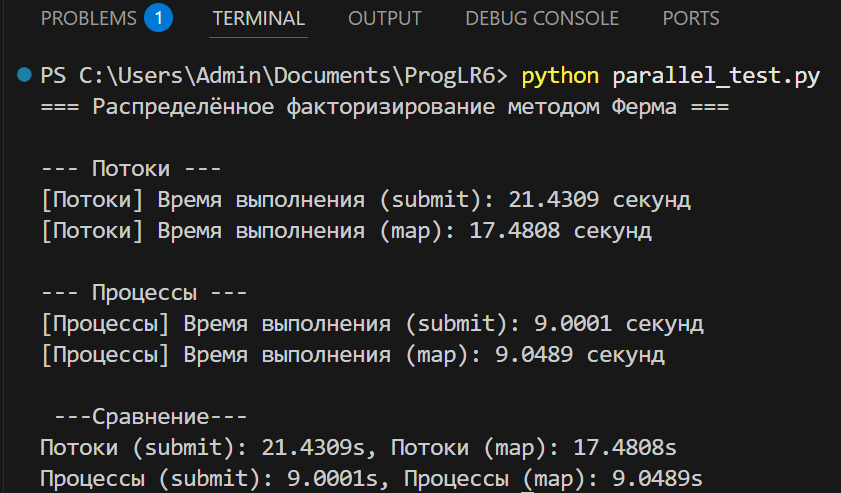

## Лабораторная работа: Ускорение метода Ферма с помощью Cython и параллельных вычислений.

# Цель работы
Оптимизация алгоритма факторизации методом Ферма для больших числе с использованием:
- **Cython** - для ускорения критических участков кода.
- **Параллельных вычислений** - с помощью потоков и процессов.

# Выполненные шаги

1. Реализация метода Ферма на Python
- Написана функция **fermat_factorization** и вспомогательная **is_perfect_square(n)**.
- Базовая версия использует модуль **math** и работает медленно на больших числах.

2. Оптимизация с использованием Cython

- Создан файл **[fermat_cython.pyx](Lr6/fermat_cython.pyx)** с типизированными версиями функций:
- Скомпилирован через **[setup.py](Lr6/setup.py)**.

3. Многопоточность и многопроцессность
- Создан скрипт **[parallel_test.py](Lr6/parallel_test.py)**, использующий:
- - ThreadPoolExecutor - для запуска в потоках
- - ProcessPoolExecutor - для запуска в процессах
- В обоих случаях выполнен:
- - executor.submit(...)
- - executor.map(...)

4. Замеры производительности
- Проведены тесты на массиве больших чисел **TEST_LST**
- Замерено время выполнения для:
-  - Потоков (submit и map)
-  - Процессов (submit и map)

# Результаты тестов

# Вывод
Многопроцессный подход оказался в 2 раза быстрее многопоточного благодаря лучшей изоляции и загрузке всех ядер процессора.

# Файлы проекта
- [fermat_cython.pyx](Lr6/fermat_cython.pyx) - Cython-реализация метода Ферма.
- [setup.py](Lr6/setup.py) - Скрипт для компиляции **.pyx** файла.
- [parallel_test.py](Lr6/parallel_test.py) - Сравнение производительности потоков и процессов.
- [main.py](Lr6/main.py) - простой запуск и тестирование.

# Вывод
Использование **Cython** позволило значительно ускорить вычисления, а **многопроцессная параллельная обработка** дала наилучший результат по производительности. Такие подходы важны при работе с ресурсоемкими алгоритмами, особенно в задачах криптоанализа или обработки больших данных.
