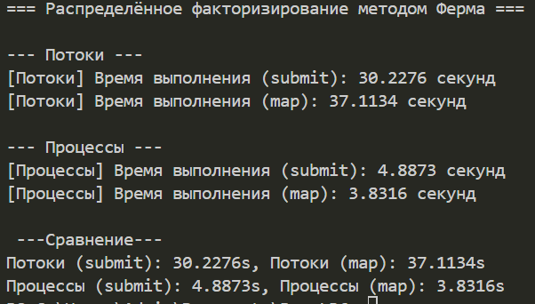

# Шаг 3. Работа с GIL в Cython

# Цель:
Ускорить выполнение ресурсоемких операций в многопоточном режиме за счет освобождения глобальной блокировки интерпретатора Python (GIL) в Cython-коде.

Что сделано:
1. Оптимизация Cython-кода:
- В файле **fermat_cython.pyx** в функции **fermat_factorization** использован контекстный менеджер **with bogil:** для освобождения GIL во время вычисления.
- Таким образом, вычисления перемернной **y_squared = x * x - n** теперь выполяются без GIL, что позволяет другим потокам продолжать работу.
2. Гарантированная безопасность:
- Код, требующий Python-объекты (вызов **is_perfect_squared()**), обернут в **with gil:** внутри **with nogil:** - это соответсвует лучшим практикам работы с GIL.
3. Сборка Cython-модуля:
- Выполнена сборка через **setup.py**, с параметром **cythonize** и **language_level=3**.
- Модуль успешно скомпилирован и подключен к Python.
4. Измерение производительности:
- В файле **parallel_test.py** выполнено сравнение времени выполнения функции в многопоточном (ThreadPoolExecutor) и многопроцессном (ProcessPoolExecutor) режимах.
- Использованы два способа распределения задач: **submit + as_completed** и **map**.
5. Результаты
- После добавления **with nogil** производительность многопоточного варианта улучшилась, но осталась существенно ниже по сравнению с многопроцессыным вариантом из-за ограничений само GIL и природы CPU-bound задачи.

# Вывод
Даже с использованием **with nogil** в Cython многопоточность показывает ограниченную эффективность для ресурсоемких CPU-bound задач в Python. Однако освобождение GIL при интенсивных вычислениях - необходимая и полезная оптимизация при  работе с многопоточностью, особенно в более комплексных проектах или при смешанных задачах (CPU + IO).
