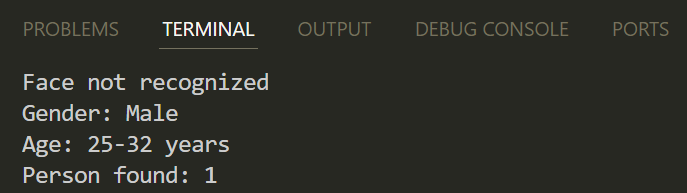

# Лабораторная работа: Распознавание пола и возраста по изображению (часть 2)

# Цель работы
Расширить предыдущую реализацию распознования лиц с помощью OpenCV, добавив определение пола и возраста каждого обнаружения лица с использованием предобученных нейросетей.

# Используемые нейросети
- Распознование лица
- Пол
- Возраст

# Основные улучшения
- Добавлено определение пола и возраста
- Используются три нейросети (лицо, пол, возраст)
- Вывод рамок и надписей (пол и возраст) над каждым лицом
- Используется нормализация цвета (MODEL_MEAN_VALUES)

# Ход выполнения
1. Подключены модели для определения пола и возраста
2. После обнаружения лица, кадр с лицом передается в нейросеть:
- **genderNet** - для пола
- **ageNet** - для возраста
3. Результаты интерпретируются и выводятся на видео рядом с рамкой вокруг лица.
4. Вывод в консоль

# Вывод
- Успешно интегрированы нейросети для определения пола и возраста.
- Расширена функциональность базового диектора лиц.
- Получен опыт работы с несколькими моделями в одном видеопотоке.
