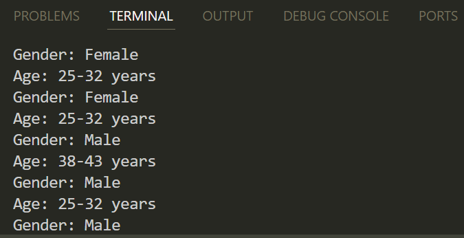

# Лабораторная работа: Распознование пола и возраста с обработкой как видео, так и изображений (часть 3)

# Цель работы
Доработать реализацию из части 2: добавить поддержку обработки как видеопотока с камеры, так и одиночных изображений через аргументы командной строки.
Повысить удобство использования и универсальность кода.

# Используемые нейросети
- Распознование лица
- Определение пола
- Определение возраста

# Основные улучшения
- Гибкий ввод (изображение/видео)

Поддержка запуска программы как с видеокамерой, так и с изображением по флагу **--image**.
- Использование argparse
  
Добавлен парсер командной строки для удобного задания входных данных.
- Единый код обработки
  
Унифицированная логика обработки потока и изображения.
- Повторное использование кода
  
Используется одна и та же логика для обработки лиц, определения пола и возраста как на фото, так и в видео.

# Ход выполнения
1. Добавлен парсер **argparse** с параметром **--image** для задания пути к изображению.
2. Если аргумент **--image** не передан - запускается видеопоток с веб-камеры.
3. Распознование лиц через **faceNet**, определение пола - **genderNet**, возраста - **ageNet**.
4. Визуализация рамок и подписей (**gender, age**) для каждого лица.
5. Вывод результатов также производится в консоль.


# Пример запуска
Обработка видео с камеры

```bash python age_gender_detection_image_and_webcam.py```

Обработка изображения

```bash python age_gender_detection_image_and_webcam.py --image path_to_image.jpg```

# Вывод в консоль

# Вывод
- Реализация стала более универсальной за счет поддержки изображений.
- Усовершенствован пользовательский интерфейс командной строки.
- Расширен опыт работы с OpenCV, аргументами командной строки и обработкой изображений/видео в едином коде.
- Повышена масштабируемость проекта: теперь один файл - два варианта ввода.
