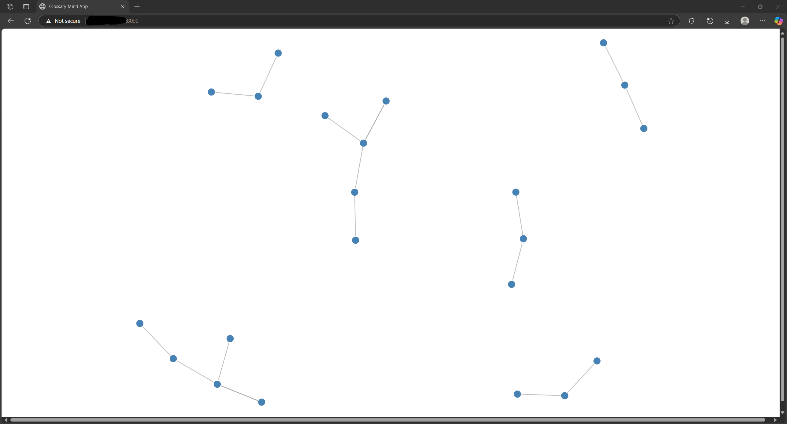

# gRPC Glossary Microservice Словарь с Визуализацией (Glossary + MindMap)

## Описание проекта

Веб-сервис для предоставления глоссария терминов через gRPC API с возможностью визуализации связей между терминами.

В рамках лабораторной работы был разработан и развернут глоссарий терминов в формате gRPC-сервисе с веб-интерфейсом для визуализации в виде семантической карты (MindMap).

Проект реализован с использованием:
- gRPC + Protobuf
- Flask (веб-интерфейс)
- D3.js (визуализация графа)
- Docker + Docker Compose
- VDS-сервер (развертывание)
- Markdown-отчет

# Этапы реализации
1. Разработка gRPC-сервиса
- Спроектирован протокол **glossary.proto**, включающий:
- - **ListTerms** - список терминов
- - **AddTerm** - добавление термина
- Реализован сервер **glossary_server.py**
- Использован Python + grpcio + protobuf

2. Разработка клиента и фронтенда
- Flask-приложение **web/app.py** обращается к gRPC-серверу
- Визуализация графа понятий через D3.js (**graph.js**)
- Отображение названий, определений, связей и источников

3. Контейнеризация
- Использован **Docker** и **docker-compose**:
- - **server** - gRPC API
- - **web** - Flask-интерфейс
- Настроена внутреняя сеть, проброс портов:
- gRPC: 50051
- Web: 8090 (проброшен наружу)

```docker-compose up --build -d```

4. Развертывание на VDS
- Проект перенесен на VDS
- Запуск docker-compose с учетом занятых портов

# Доступ к интерфейсу
```https://IP:8090```

# Структура проекта
```
grpc_glossary_project
├─ data
│  └─ terms.json # Словарь терминов в JSON
├─ docker-compose.yml # Контейнеризация
├─ grpc_test_client.py # Тестирование
├─ proto
│  └─ glossary.proto # Протокол gRPC
├─ server #gRPC-сервер
│  ├─ Dockerfile
│  └─ glossary_server.py # Реализация сервиса
└─ web # Веб-клиент Flask
   ├─ app.py # Flask-приложение
   ├─ Dockerfile
   └─ templates
      └─ graph.html # Шаблон с визуализацией MindMap
```
## Быстрый старт

### 1. Клонируйте проект и соберите контейнеры:

```
docker-compose up --build -d
```

- gRPC сервер доступен на ```localhost:50051```
- Веб-интерфейс: ```http://localhost:8080/```

### Структура
- glossary.proto: описание API
- glossary_server.py: реализация сервиса
- app.py: веб-визуализация на FLASK + D3.js

### Визуализация
- Список терминов и их связи показаны в виле графа.
- Использован ```D3.js force layout```

### Особенности выбора Docker
- **Docker** выбран как кроссплатформенное решение, поддерживаемое большинством CI/CD пайплайнов и хостинг-платформ, изоляция окружения, быстрое масштабирование.
- **Protobuf + gRPC**: компактность, строгость схем, скорость передачи.
- **Flask + D3.js**: простая интеграция с HTML + визуализация графов.

### Инструкция по разертыванию на сервере
1. Установить Docker и Docker Compose
2. Развернуть проект:
```
git clone <имя_репозитория>
cd grpc_glossary_project
docker-compose up --build -d
```
3. Открыть http://<ваш-IP>:8090 для визуализации


